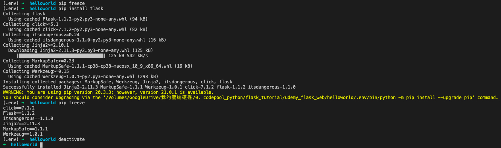

# Python Environmental Setting  

* 要開始用python前，我們要先學如何安裝python  
* 對我的mac來說(對linux應該也是)，系統其實有預先安裝python了，只是是2.0的版本，並不適合使用。可以在terminal中輸入`python --version`來查看  
* 那我是用`pyenv`這個python版本管理工具，來進行python的安裝  
* 他的好處是，有一個統一的架構，可以安裝各種版本的python。並視專案的需要，可以輕鬆切換不同版本的python來使用  
* 那就先整理：  
  * OS 為 mac, terminal為zsh  
  * 安裝方式為透過`pyenv`來安裝  
* 至於其他作業系統(e.g. Linux, Windows)，或其他安裝方式(e.g. 直接安裝python, 透過anaconda安裝...)，就留待之後有空再整理  
* 以下會整理我實際的操作步驟，至於細節，可以到`pyenv`的官網去看: https://github.com/pyenv/pyenv 


## [mac + zsh shell] 用pyenv，安裝/切換 python  

### 先安裝pyenv  

* 首先，在mac上，用homebrew來下載`pyenv`這個套件  

```
brew update
brew install pyenv
```

* 安裝完成後，確認一下目前根目錄下，有沒有 `.zshrc` 這個檔案  

```
open ~/.zshrc
```

* 應該是會有拉。如果沒有的話，就新增這個檔   

```
touch ~/ .zshrc
```

* 然後，在terminal輸入以下指令：  

```
echo -e 'if command -v pyenv 1>/dev/null 2>&1; then\n  eval "$(pyenv init -)"\nfi' >> ~/.zshrc
```

* 其實上面這行，等價於你先打開.zshrc檔(i.e. `open / .zshrc`)，然後在"最下面"，加入以下指令：  

```
if command -v pyenv 1>/dev/null 2>&1; then
  eval "$(pyenv init -)"
fi
```

* 這個指令的重點就是，`eval "$(pyenv init -)"`，用意是Add `pyenv init` to your shell to enable shims and autocompletion。那每次我們開shell時，他都會幫我們執行 `pyenv init`，那使用python時，就會到pyenv指定的路徑找python，而不會找到系統版的python(2.x.x版)  

* restart shell，讓設定生效

### 安裝指定版本的python  

* 在terminal中輸入以下指令  

```
pyenv install 3.8.0
```

* (Todo: 去確認reticulate網頁，我記得要讓R可以用的話，pyenv install 3.8.0後面還要加argument才行)  
* 安裝完成後，確認現在pyenv有哪些版本：  

```
pyenv versions
```

* 有加`*`的，表示目前正在使用的版本  

### 切換/指定 要使用的python的版本  

* 先學這個簡單的就好，我們用以下指令來指定我要用的版本：  

```
pyenv global 3.8.0
```

* 那確定一下有切換過去：  

```
pyenv versions
```

* 並用系統指令再確認一下，現在在用的版本  

```
python --version # 看正在使用的python的版本
which python # 看使用的python的路徑
```

### 先用terminal快速執行一個.py檔  

* 確認沒問題後，我們在桌面新增這個`myfirstpython.py`檔案  

```
# myfirstpython.py
print("Hello Python")
```

* 然後，在terminal輸入以下指令，即可執行： 

```
python myfirstpython.py
```

* 前面的`python`，他就會去找現在路徑底下的python，也就是`which python`的這個python  
* 後面的`myfirstpython.py`，他是去找現在工作目錄下的這個.py檔，也就是`pwd`下的`myfirstpython.py`  
* 所以，也可以給絕對路徑，來執行.py檔：  

```
/Users/hanklee/.pyenv/shims/python /Users/hanklee/Desktop/myfirstpython.py
```

### pyenv 常用命理整理  

#### Python配置  

```
# 檢視系統當前安裝的python列表
pyenv versions

# 列出可安裝版本
pyenv install --list 

# 安裝指定版本 Python
pyenv install -v 3.5.1

# 解除安裝指定版本 Python
pyenv uninstall 2.7.3

# 顯示當前python安裝路徑
pyenv which python 

# 建立墊片路徑
# 為所有已安裝的可執行檔案建立 shims
# 如：~/.pyenv/versions/*/bin/*
# 每當你增刪了 Python 版本或帶有可執行檔案的包（如 pip）以後，都應該執行一次本命令
pyenv rehash
```

#### Python 切換  

```
#  設定全域性的 Python 版本，通過將版本號寫入 ~/.pyenv/version 檔案的方式
pyenv global <版本號>

# 設定面向程式的本地版本，通過將版本號寫入當前目錄下的 .python-version 檔案的方式。通過這種方式設定的 Python 版本優先順序較 global 高。
# pyenv 會從當前目錄開始向上逐級查詢 .python-version 檔案，直到根目錄為止。若找不到，就用 global 版本。
pyenv local <版本號>

# 設定面向 shell 的 Python 版本，通過設定當前 shell 的 PYENV_VERSION 環境變數的方式。這個版本的優先順序比 local 和 global 都要高。
pyenv shell <版本號>

# --unset 引數可以用於取消當前 shell 設定的版本。
pyenv shell --unset
```

## [linux + bash shell] 安裝python待整理  

## [windows + gitbash] 安裝python待整理  

## 用pip安裝/移除/條列套件  

* pip本身就是個python的package，他的用途是協助安裝python的第三方package  
* 從python 3.4以後，只要安裝python，就會幫你安裝pip這個package，但版本可能比較低，所以還要自己更新  
* 整理常用的指令如下：  

```
# 先確認版本已是最新版
pip install --upgrade pip

# 安裝套件
pip install flask
sudo pip install flask # linux

# 移除套件
pip uninstall flask

# 觀看目前所有安裝過的套件
pip freeze
```

* 這邊特別注意最後一個指令`pip freeze`，他列出所有目前安裝過的套件與版本號，這對reproducible research很有用  

## requirements.txt  

* 假設現在我們用python開發了一個package，而開發過程中，我陸續安裝了很多package來搭配使用，那，當別人用我的package時，他也需要安裝我曾經安裝過的這些packages，才能正常使用  
* 那這時就可以這樣做：  

```
# 將目前系統有安裝過的python package條列出
# 存成requirement.txt，提供給別人
pip freeze >> requirement.txt

# 別人只要下載你的requirement.txt
# 並執行以下指令即可reproduce你用的套件版本
pip install -r requirements.txt
```

* 所以，我們如果去github看人家python的專案，例如ansible/ansible這個專案，就可以看到他有附"requirements.txt"這個檔案  


## 用virtualenv來隔離乾淨的開發環境  

* 剛剛用"requirements.txt"來解決package和版本問題，似乎很方便，但其實很多小問題在裡面  
  * 例如，你的python從安裝開始，到你開發結束，早就安裝一堆package了，其中很多package是和你的專案無關的，但你用`pip freeze`就只能全抓  
  * 我們常常不只開發一個專案，有可能當我們開發專案A時，install了flask，然後當我們開發專案B時，又install了flask，而這兩個flask的版本是不同的。假設前者的版本是flask 1.1.0，後者是flask 1.2.0，那當我們用`pip freeze`時，他只會保留最新的，也就是`flask 1.2.0`，那...就有可能在re-run A專案時，遇到bug，因為flask的版本已經不一樣了  
* 為了解決這個問題，python的熟手，都是習慣每個專案擁有自己的虛擬環境(virtual environment)，那我的package就裝在自己的虛擬環境中，到時候要打包，要freeze灌過的package給人家，就直接在這虛擬環境中下指令就好  

### 用terminal，透過`virtualenv()`來開虛擬環境   

* 我直接用flask課堂上的專案來做舉例  
  * 首先，我開啟VSCode，用他的terminal功能，把工作目錄，切到以下路徑：`/Volumes/GoogleDrive/我的雲端硬碟/0. codepool_python/flask_tutorial/udemy_flask_web/helloworld`  
  * 並且確認一下當前使用的python版本，與python路徑  
  * 然後執行以下兩個指令，來建立並進入虛擬環境  

```
# 在當前目錄下，建立一個虛擬環境資料夾，叫`.env`
# (要不要加`.`都無所謂，你要寫`env`或`hahaha`都可以)  
virtualenv .env

# 進入此虛擬環境  
source .env/bin/activate
```

* 截圖如下：  

  

* 進入虛擬環境後，我們可以用`pip freeze`觀察，目前已經安裝哪些套件了，結果發現啥都沒有(合理嘛)  
* 然後安裝flask後(`pip install flask`)後，再觀察一次`pip freeze`，就看到已經安裝許多東西進去了  
* 我們可以用`pip freeze >> requirement.txt`把這個結果寫出來  
* 最後，要離開時，再key入`deactivate`，就跳出此虛擬環境了。  
* 截圖如下：  

  


### 用terminal，透過`pyenv-virtualenv`來開虛擬環境  

* 這邊還沒用過，我從[此網頁](https://www.mdeditor.tw/pl/2UoX/zh-tw)把操作流程copy下來，他整理的蠻清楚的。  
* pyenv-virtualenv 是 pyenv 下基於 virtualenv 的一款外掛，通過 pyenv-virtualenv 外掛可以很好的和 virtualenv 結合。  

#### 安裝  

* 使用 homebrew 安裝 `pyenv-virtualenv` :  

```
brew install pyenv-virtualenv
```

* 安裝之後需要執行如下配置：  

```
# 使用 zsh shell
vim ~/.zshrc

# 使用系統預設
vim ~/.bash_profile

# 在 `.zshrc` 或 `.bash_profile` 檔案最後寫入：
# pyenv-virtualenv
if which pyenv-virtualenv-init > /dev/null;
  then eval "$(pyenv virtualenv-init -)";
fi

# 使配置生效
source ~/.zshrc
# or
source ~/.bash_profile
```

#### 使用  

```
# 建立虛擬環境
# 若不指定 Python 版本，預設使用當前環境 Python 版本
pyenv virtualenv <Python 版本號> <虛擬環境名稱>

# 列出當前虛擬環境
pyenv virtualenvs

# 啟用虛擬環境
pyenv activate <虛擬環境名稱>

# 退出虛擬環境
pyenv deactivate

# 刪除虛擬環境
pyenv uninstall <虛擬環境名稱>
```

### 用vscode開虛擬環境專案

### 用pycharm開虛擬環境專案  


