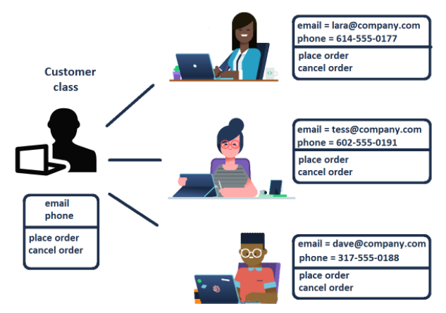

# OOP Fundamentals

## What is OOP?

* OOP是一種programming的設計思維，他以object為coding的最小單位。  
* 那到底什麼是object？要回答這個問題，我們要先學會什麼是class。  
* 之前在寫code的時候，我們都會命名出很多variable，那現在，我們用分類問題的角度去想，是不是某一群variable，可以一起被歸為一類？如果可以的話，那我要要定義的，就不會是一個variable，而是要定義出一種類別(class)！
* 舉例來說，今天我想定義出顧客(Customer)這個class，那我該怎麼定義呢？我們會用state和behavior這兩個方向來定義一個class。
* state指的是這個class所具備的特徵，behavior是指這個class所能施展的行為。  
* 所以，回到顧客這個class的例子，state我就可以定義成email和phone這兩個特徵(因為每個顧客，應該都具備這兩個特徵)，behavior我就定義成"跟我下單"和"跟我取消訂單"這兩種行為。那做到這邊，我就算完成了Customer class的定義。
* 接下來，我只要填入state特定的value，就可以realize出各式各樣的客戶。例如我想realize出A客戶，那我就把A客戶的email和phone填入就好。而這樣realize完後，我們就稱這個A客戶是一個object。此時，我們知道他的states(email和phone都有)，也知道他有可能對我們施展的behavior(下訂單 & 取消訂單)
* 所以，我可以realize各式各樣的object with specific state value(在此例，就是realize各式各樣的客戶)
* 以圖來描述，可以畫成下面這張圖：
{width="477"}

* 所以總結一下，Class和Object可以這樣定義：
  - **Class** 就是一個object製造機，他是一個抽象的概念。這個製造機像個藍圖一樣，告訴我們怎麼具體化一個實例(instance)出來。而藍圖裡面寫的東西，就是有關這個class該有的*states*以及*behavior*.  
  - **Object** 就是instance，他是該class所建造出來的一個具體實例。

* 與OOP對比的另一種設計思維，是R的procedural programming。R code的寫法，就像一步又一步的步驟，把結果給做出來。 
* 但OOP不是這樣，OOP的寫法強調的不是步驟，而是object間的互動(e.g. 繼承/多形)。兩者的比較如下表：

+-------------------------------------+-----------------------------------------+
| Procedural programming              | Object-oriented programming             |
+=====================================+=========================================+
| Code as a sequence of steps         | **Code as interactions of objects**     |
+-------------------------------------+-----------------------------------------+
| Great for data analysis and scripts | Great for building frameworks and tools |
+-------------------------------------+-----------------------------------------+
|                                     | *Maintainable and reusable code*        |
+-------------------------------------+-----------------------------------------+


## OOP in Python

* 在python裡面，所有東西，都是object!!  
* 例如，你隨便key個6，6就是一個object，你只要把它存成變數，就可以看到他所屬的class  

```{python}
a = 6
print(type(a)) #class
```

-   隨便整理python裡面的各式各樣object，以及他所屬的class:

    +-----------------------+---------------------+-----------------------+
    | Object                | Class               | remark                |
    +=======================+=====================+=======================+
    | 5                     | int                 |                       |
    +-----------------------+---------------------+-----------------------+
    | "Hello"               | str                 |                       |
    +-----------------------+---------------------+-----------------------+
    | pd.DataFrame()        | DataFrame           |                       |
    +-----------------------+---------------------+-----------------------+
    | np.mean               | function            |                       |
    +-----------------------+---------------------+-----------------------+
    | ...                   | ...                 |                       |
    +-----------------------+---------------------+-----------------------+

-   既然所有東西都是object，那我應該有他的state和behavior訊息吧？在python中，state的訊息，被存在attribute中，behavior的訊息，被存在method中。

    -   **Attributes** encode the state of an object and are represented by variables. 例如，`.shape`就是numpy.ndarray object的一個attribute，注意到他是用variable的形式存在的，所以shape後面沒有括號。
    -   **Methods** encode behavior of an object and are represented by functions. 例如，`.reshape()`就是numpy.ndarray的method。注意到他是用function的形式存在的，所以會看到括號，括號內也可能要輸入argument

-   來看個numpy object例子：

```{python}
import numpy as np
a = np.array([1,2,3,4])
# 看a是哪種class
print(type(a))
```

```{python}
# shape attribute
a.shape
```

```{python}
# reshape method
a.reshape(2,2)
```

-   最後，提醒一下，一個程式語言可以是OOP，或是procedural，或是both。例如Python就是both，我們可以用procedural的寫法，一步一步的做完data analysis，但也可以用OOP的寫法來做。R也是如此，只是R的OOP要借助第三方套件`R6`

## My first class

-   開始來寫我的第一個class，就用剛剛customer的例子

```{python}
class Customer_old:
  # attribute
    
  # mehod: function definition within class
  #        use 'self' as the first argument
  def identify(self, name):
        print("I am Customer " + name)
```

-   上面這個例子，我們最一開始就宣告他是個class
-   接著，分別定義attribute和method
-   我們先看method的部分就好。這個method，其實就是我們寫過的function，只是第一個參數要幫他寫\`self\`，這是規定的，原因等等會談。
-   這樣就算定義完Customer這個class了。我要realize他的話，我就直接call他，並assign到一個variable上，也就是`cust1 = Customer()`。此時，cust1被我們稱為*instance*。然後，我就可以使用他的method了。例如：

```{python}
cust1 = Customer_old()
cust1.identify("Laura")
```

-   那現在回過頭來看，`self`到底是啥\

-   我們知道class只是一個template，他需要refer data of a particular object。而這個self，就是這個particular object的代名詞。\

-   以剛剛的例子來說，這個particular object就是我的cust1，而self就會是cust1的代名詞，所以當我們寫`cust1.identify("Laura")`的時候，其實python在內部的翻譯是`Customer.identify(cust1, "Laura")`，也就是說，我要用Customer這個class裡的identify method，然後第一個argument是指我要refer to cust1這個particular object。

-   nice，現在我們把attribute捕進去，並且稍微改寫method的地方，變成以下這樣：

```{python}
class Customer_new:
  # attribute
  # set the name attribute of an object to new_name
  def set_name(self, new_name):
    # create an attribute by assigning a value
    self.name = new_name # <- will create .name when set_name is called
        
  # mehod: function definition within class
  #        use 'self' as the first argument
  def identify(self):
        print("I am Customer " + self.name)
```

-   可以看到在attribute的地方，也是用定義funciton的方式去寫，但function body是直接用assign變數的方式，把他assign到self下面。實際使用時，變成以下這樣：

```{python}
cust2 = Customer_new() # <- .name doesn't exist here yet
cust2.set_name("Lara de Silva") # <- .name is created and set to "Lara de Silva"
print(cust2.name)
print(cust2.identify())
```

-   快速的來個類似的練習，我現在想定義Employee這個class，然後這個class的state包括name和salary(合理嘛，描述一個employee的狀態，就用名字和薪水這樣)。接著，我要realize出第一位員工，他的名字叫"Korel Rossi"，他的薪水是50000

-   第一步，定義出此class，以及所屬attribute

```{python}
class Employee:
  
  # attribute
  def set_name(self, new_name):
    self.name = new_name
  
  def set_salary(self, new_salary):
    self.salary = new_salary
```

-   第二步，realize出這位員工

```{python}
emp = Employee()
emp.set_name('Korel Rossi')
emp.set_salary(50000)
```

-   第三步，看看這員工的attribute是不是設對了

```{python}
print(emp.name)
print(emp.salary)
```

-   so far so good. 對現在這個Employee來說，state已經有了，但behavior還沒。一個員工可能可以做哪些行為？我先幫他定義一個：被加薪！所以，現在我們來寫一個method叫`get_raise(amount)`，然後他的結果可以去更新原本state中的salary

```{python}
class Employee:
  
  # attribute
  def set_name(self, new_name):
    self.name = new_name
  
  def set_salary(self, new_salary):
    self.salary = new_salary
    
  # method
  def give_raise(self, amount):
    self.salary = self.salary + amount
```

```{python}
emp = Employee()
emp.set_name('Korel Rossi')
emp.set_salary(50000)

emp.give_raise(10000)
print(emp.salary)
```

-   good，現在多寫一個method，是幫我們算他的月薪是多少

```{python}
class Employee:
  
  # attribute
  def set_name(self, new_name):
    self.name = new_name
  
  def set_salary(self, new_salary):
    self.salary = new_salary
    
  # method
  def give_raise(self, amount):
    self.salary = self.salary + amount
    
  def monthly_salary(self):
    return self.salary/12
```

```{python}
emp = Employee()
emp.set_name('Korel Rossi')
emp.set_salary(50000)

emp.give_raise(22000)
mon_sal = emp.monthly_salary()
print(mon_sal)
```

-   You might be wondering: why did we write these methods when all the same operations could have been performed on object attributes directly? Our code was very simple, but methods that deal only with attribute values often have pre-processing and checks built in: for example, maybe the company has a maximal allowable raise amount. Then it would be prudent to add a clause to the give\_raise() method that checks whether the raise amount is within limits.

## the `__init__` constructor

-   剛剛學了這幾招：

    -   在class內定義function，就叫method，且第一個argument要設self
    -   attribute也是用define function的方式做定義，只是最終都是assignment的方式，塞到`self.___`的變數中\
    -   在class內，要用到attribute時，都是用`self.___`的方式來call\
    -   realize一個object時，先call class name，再用attribute的function來做設定(例如設定Employee的name和salary)

-   關於最後一點，其實有更好的作法，就是我們幹麻先realize完，又再用attribute的function去設定？何不在realize一個object的時候，就直接把這些attribute設定進去呢？這其實是可以的，就是使用\_\_init\_\_這個constructor，看個例子就懂了：

```{python}
class Customer:
  # attribute
  def __init__(self, name):
    self.name = name # <- Create the .name attribute and set it to name parameter
    print("The __init__ method was called")
```

-   現在，只要我用這個class去create一個object時，他就會自動啟動`__init__()`這個function，而這個function要用的argument，也是在你create object時就要傳入了：

```{python}
cust_lara = Customer(name = "Lara de Silvia")
print(cust_lara.name)
```

-   nice! 這其實才是最常用的作法。之前的作法，被稱為"Attributes in methods"，也就是我在class裡面，用定義method的方式(也就是定義function的方式)，來定義一個設定attribute的function。然後create object後，再去call這些function來一一設定attribute。而現在的方式，叫做"Attribute in the constructor"，就是我直接寫一個initialize的function在最前面：`__init__(self, all_attribute_list_here)`，然後逼迫我們在create object的時候，就要把這些設定值填進去，那你其實就是在一一create出各個獨特的object。這種作法更可讀(在class內，找init，就可以一次全覽所有attribute), 更快速(create object時同步搞定), 也更容維護。\

## 寫Class的SOP  

-   最後，講一下寫class的best practices:

    -   Initialize attributes in `__init__()`
    -   命名時，class的命名都用`CamelCase`，就是單字在組合時，都是字首大寫，例如`class EmployeeWistron:`，class內定義function時，function name都是全小寫用底線串，例如`def employee_wistron():`\
    -   Keep `self` as `self`。在class內定義function時，第一個argument都是留給self用的，如果你不寫self，要寫別的，例如kitty，也是可以work，你在class內要call這些attribute時，就記得用`kitty.___`就ok，但這樣別人看你的code時會很容易亂，所以還是建議，你就乖乖寫self就好。\
    -   最後，就像寫function一樣，寫class的時候，第一行也都會寫docstrings(功能註解)，幫助自己也幫助別人了解這個class的主要功能在幹麻

-   接下來，我們就用學到的這些技巧，來重寫Employee的class。我們要用`__init__()`來設定name和salary這兩個attribute，而且，因為`__init__`就是寫function，所以，我們也可以給salary一個default值，例如GG的45000：

```{python}
class Employee:
    # Create __init__() method
    def __init__(self, name, salary=45000):
        # Create the name and salary attributes
        self.name = name
        self.salary = salary
    
    # From the previous lesson
    def give_raise(self, amount):
        self.salary += amount

    def monthly_salary(self):
        return self.salary/12
```

```{python}
emp = Employee("Korel Rossi")
print(emp.name)
print(emp.salary)
```

-   nice，這邊又提醒，`__init__()`很適合拿來做data preprocessing。例如，這邊的薪水一定要\>=0，所以，如果在create object的時候，輸入負的薪水，我想要print出你key錯了，薪水要正的，並主動先幫他把薪水設成0

```{python}
class Employee:
  
    def __init__(self, name, salary=0):
        self.name = name
        # Modify code below to check if salary is positive
        if salary>=0:
            self.salary = salary
        else:
            self.salary = 0
            print("Invalid salary")
   
   # From the previous lesson
    def give_raise(self, amount):
        self.salary += amount

    def monthly_salary(self):
        return self.salary/12
```

```{python}
emp = Employee("Korel Rossi", -1000)
print(emp.name)
print(emp.salary)
```

-   最後，如果我想使用其他package的function時怎麼辦？我要import在class外面還是裡面？答案是：外面！！以下舉個例子，我想要多加一個attribute叫hire\_date，他可以在我建立這個employee的object時，直接assign當天日期進去。所以，我需要用到`datetime`這個package裡面的function，叫`today()`。請見以下範例：

```{python}
# Import datetime from datetime
from datetime import datetime

class Employee:
    
    def __init__(self, name, salary=0):
        self.name = name
        if salary > 0:
          self.salary = salary
        else:
          self.salary = 0
          print("Invalid salary!")
          
        # Add the hire_date attribute and set it to today's date
        self.hire_date = datetime.today()
        
   # From the previous lesson
    def give_raise(self, amount):
        self.salary += amount

    def monthly_salary(self):
        return self.salary/12
      
emp = Employee("Korel Rossi", -1000)
print(emp.name)
print(emp.salary)
print(emp.hire_date)
```
