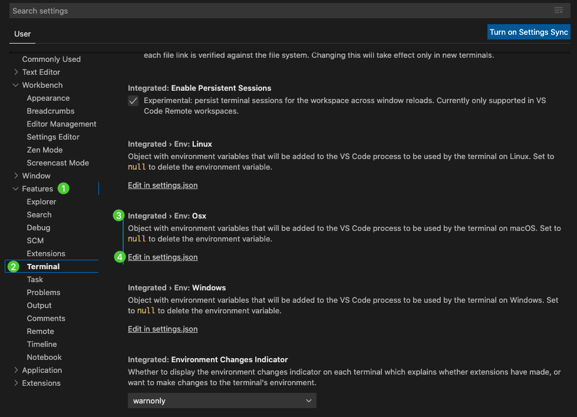

# 執行Python的code  

## command line  

### 用interactive mode 執行  

* 在command line，打`python`或`ipython`，就會進入互動視窗，然後就可以互動的執行了  
* 要結束時，再按`quit()`，就會退出視窗  

```
ipython
print("Hello, World")
quit()
```

### 寫成.py檔後執行  

* 我們可以開一個script，在裡面寫code，然後存成.py檔，例如`hello.py`  
* 然後，在command line，用`python /path/to/this/file/hello.py`，就可以執行這個.py檔了  

## 在VS code中執行  

### 設定要使用的python版本  

* 以下內容，整理至官方網站： https://code.visualstudio.com/docs/python/environments  
* 打開VS code後，輸入command+shift+p (`⇧⌘P`)，然後key入`preferences: open user settings`，開啟設定。然後照下面圖面做設定：  



* 打開json檔後，做以下的輸入：  

```
{
    "jupyter.alwaysTrustNotebooks": true,
    "python.pythonPath": "/Users/hanklee/.pyenv/versions/3.8.0/bin/python",
    "terminal.integrated.env.osx": {
    
    "PATH": ""
    }
}
```

* 這邊要注意的只有裡面的兩行一定要有：  
  * `"python.pythonPath": "/Users/hanklee/...."`， 這邊的路徑，就是放你想要跑的版本。例如我都用`pyenv`來管理我的python version，那我可以在terminal用`pyenv global 3.8.0`來選定我要用3.8.0的版本後，再下`which python`，來得到這個版本的路徑。做完這行設定後，只要在VScode中點視窗右上角的run，他就會幫你下達這個指令：`path/to/python/version path/to/this/file`。    
  * `"PATH": ""`，這個指令，是我google到的解法([連結](https://stackoverflow.com/questions/54582361/vscode-terminal-shows-incorrect-python-version-and-path-launching-terminal-from/55043991))，主要是要解決，在VScode中，我開視窗下面的terminal，但執行python時，還是沒有執行到`python.pythonPath`的版本。  

### 腳本執行  

* 這邊再找時間舉個例子做截圖吧。用`hello-world.py`這種script，示範點選畫面右上角的箭頭來run，或是底下的terminal自己key `python hello-world.py`都可以。  

### 逐行執行  

* 逐行執行的部分，要再查一下，目前就只會在jupyter中逐行執行，但很笨  

### debug

* ToDo...

## 在 RStudio 中執行  

* 應該要用Reticulate的架構來整理，等有空再說吧  

### 新增檔案/python script   

* 只要新增一個.py的檔案，就可以像寫R一樣逐行執行  

### 用RMarkdown  

* 開RMarkdown檔案，然後用`command + option + p`，開啟python的chunk，就可以執行了   
